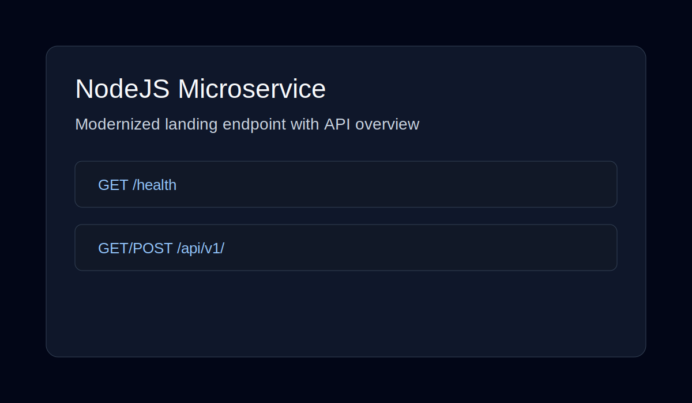

# nodejs-microservice-exercises

Node.js microservice exercises focused on Express, filesystem data handling, and iterative refactoring.

## Live docs page

https://nodejs-microservice-modernized.netlify.app

## What was modernized

- Added a cleaner landing page for the root endpoint.
- Added a dedicated health endpoint (`GET /health`).
- Added a static docs/deployment page for a polished public preview.
- Updated README with practical run instructions and project context.

## Screenshot



## API endpoints

- `GET /` — service landing page (HTML)
- `GET /health` — health response (`{ ok: true }`)
- `GET /api/v1/` — list users/data from filesystem
- `POST /api/v1/` — create user/data entry

## Local development

```bash
npm install
npm run start
```

## Build

```bash
npm run build
```

## Tests

```bash
npm test
```

Run smoke tests (Netlify docs + local API on port 3000):

```bash
# Terminal 1
NODE_HOSTNAME=127.0.0.1 NODE_PORT=3000 NODE_NAME=nodejs-ms npm start

# Terminal 2
npm run smoke
```

## Branch history

- `version/base`
- `version/back-to-ep`
- `version/filesystems-fs`
- `version/2nd-challenge`
- `version/refactoring`
- `version/fs-use-cases-post`
- `version/testing`
- `version/testing-post-spec`
- `main`
